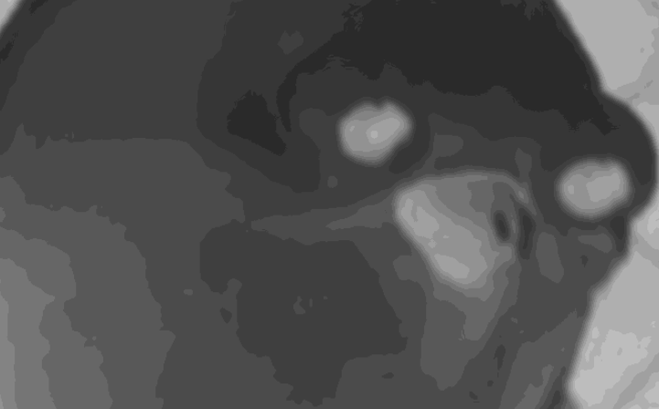
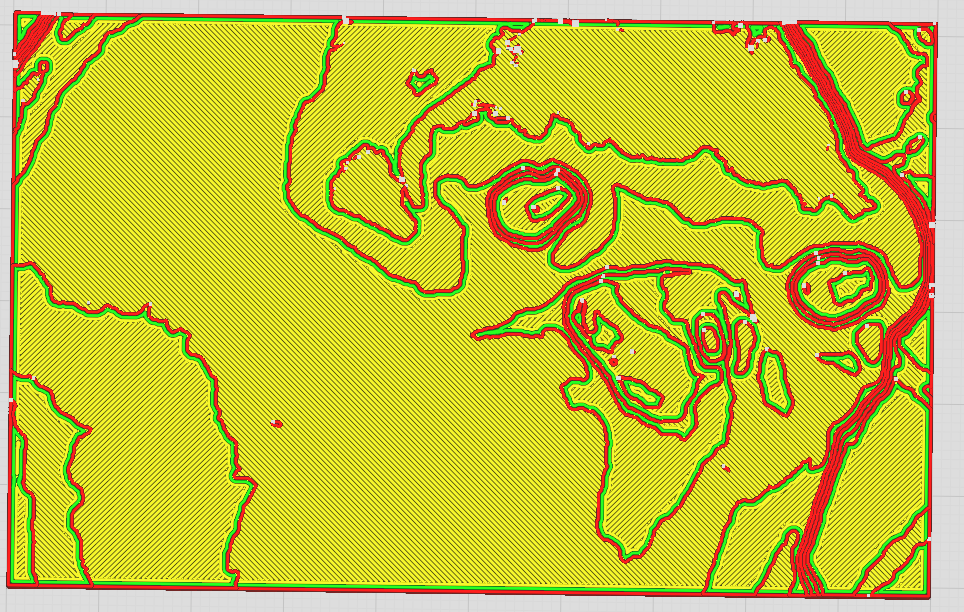

# Lithophane 3D Converter

<p align="center">
  
  
</p>

A modern web application that converts 2D images into 3D printable lithophane STLs. Optimized for creating layered multi-color prints (Hueforge-style) or standard high-quality lithophanes.

## Features

- **Instant 3D Preview**: Visualize your lithophane layer by layer in real-time. Switch between 2D grayscale and 3D mesh views.
- **Image Cropping**: Crop your uploaded images directly in the app to focus on the subject.
- **Image Processing**:
  - **Adjustments**: Fine-tune *Contrast*, *Brightness*, and *Gamma* directly in the browser.
  - **Background Removal**: Automatically remove backgrounds with adjustable thresholding.
- **Shape Variations**:
  - **Flat**: Standard rectangular lithophanes.
  - **Curved**: *Cylinder*, *Arc*, and *Sphere* mappings for lampshades and ornaments.
- **Advanced Frame Styles**:
  - **Border Profiles**: *Flat*, *Rounded*, *Chamfer*, *Classic Frame* (decorative), and *Oval*.
  - **Mounting Holes**: Drill precise mounting holes through the model for hanging or mounting.
- **Layer Control**:
  - **Layer Count**: Quantize your image into specific numbers of height layers (great for filament swapping).
  - **Layer Visibility**: Toggle specific layers on/off to create cutouts or transparent styles.
- **Geometry Settings**:
  - **Base Thickness**: Add a solid base layer for structural integrity.
  - **Dimensions**: Set physical print width and min/max heights in mm.
- **Workflow**:
  - **Persistence**: Settings are automatically saved to your browser so you never lose your work.
  - **Stand Generator**: Create a custom-fitted stand for your specific lithophane dimensions.

## Tech Stack

- **Frontend**: React + TypeScript + Vite
- **Styling**: TailwindCSS
- **3D Engine**: Three.js + React Three Fiber
- **Processing**: Client-side canvas manipulation and geometry generation.

## Getting Started

1.  Clone the repository:
    ```bash
    git clone https://github.com/apeckdev/lithophane-3d-converter.git
    cd lithophane-3d-converter
    ```

2.  Install dependencies:
    ```bash
    npm install
    ```

3.  Run the development server:
    ```bash
    npm run dev
    ``` 

4.  Build for production:
    ```bash
    npm run build
    ```

## Usage

1.  **Upload**: Drag & drop an image or select one from your device.
2.  **Crop**: Adjust the crop frame to select your desired print area.
3.  **Adjust**: Use the settings panel to tune:
    *   **Image**: Adjust contrast/brightness and remove background.
    *   **Shape**: Choose between Flat, Cylinder, Arc, or Sphere.
    *   **Frame**: Select a border style (e.g., Classic Frame) and enable mounting holes.
    *   **Layers**: Set layer count and physical thickness (Min/Max Height).
    *   **Quality**: Adjust pixel resolution and smoothing.
4.  **Download**: Click "Download STL" to get your file ready for your slicer.

## License

MIT
